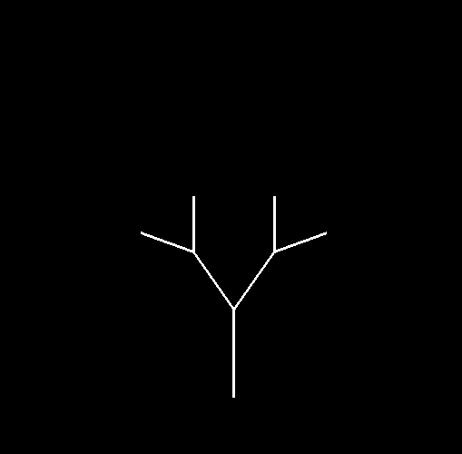
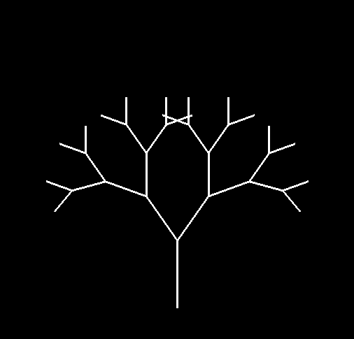
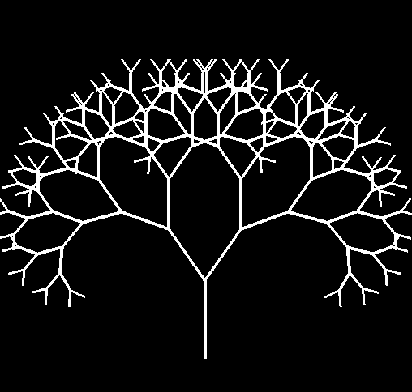
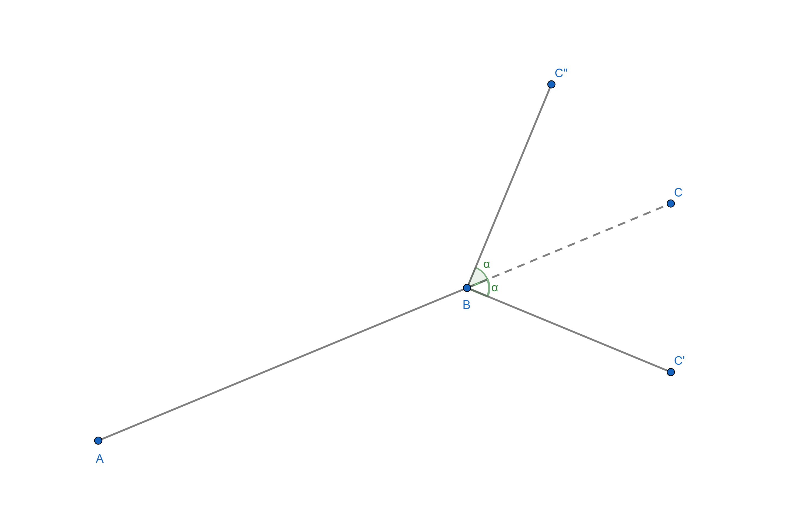
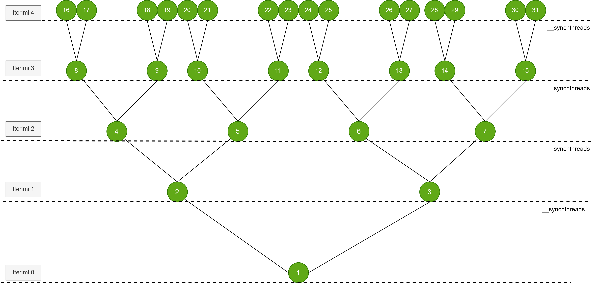
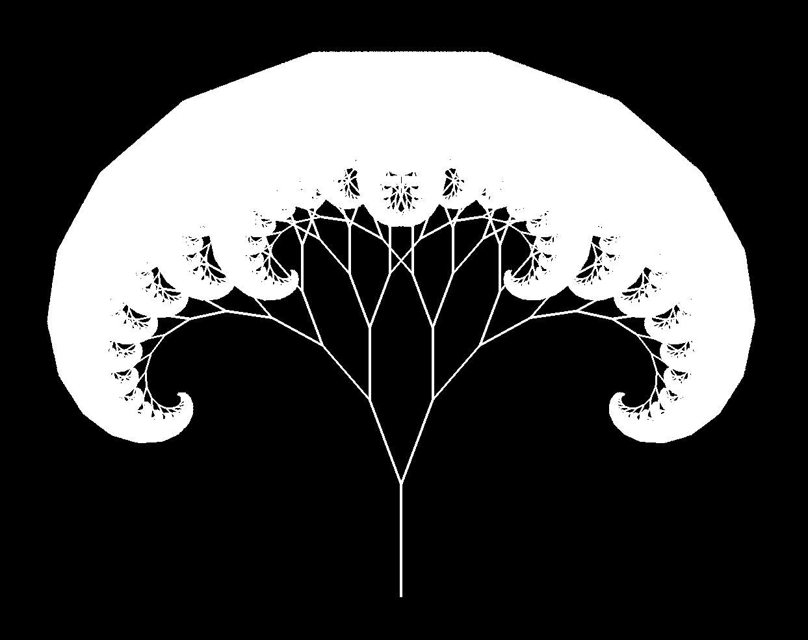

# Parallel-Fractal-Tree
 GPU-accelerated fractal tree generation with CUDA and OpenGL interoperability.
 
# Fractal Tree

Fractal Tree is a popular fractal that visually represents
the concept of recursion in nature. The construction of this fractal begins with
a single trunk, which then splits into two branches at an angle
assigned. Each of these branches is further divided into two smaller branches,
continuing this process recursively. The first iterations of this fractal are shown in the images below.

<div>
  <p>
    
    
    
    
  </p>
</div>

## Constructing branches

Let the points be $A(x_1, y_1)$ and $B(x_2, y_2)$. We have to find the point
$C(c_1, c_2)$ so that
$\overrightarrow{AB} = \lambda \overrightarrow{BC}$, and the points $C'$ and
$C''$ so that $\angle CBC' = \alpha = \angle CBC''$. 

<p>
   
</p>

\
From the equation $\overrightarrow{AB} = \lambda \overrightarrow{BC}$ we get

$$(x_2 - x_1, y_2 - y_1) = \lambda (c_1 - x_2, c_2 - y_2)$$

\
By equating the corresponding coordinates of the pairs listed on both sides
of the equation we get

$$x_2 - x_1 = \lambda (c_1 - x_2)$$ $$y_2 - y_1 = \lambda (c_2 - y_2)$$

\
Solving for $c_1$, $c_2$ we get:

$$c_1 = \frac{x_2 (1 + \lambda) - x_1}{\lambda}$$

$$c_2 = \frac{y_2 (1 + \lambda) - y_1}{\lambda}$$

\
We rotate the point $C$ around the point $B$ by the angle $\alpha$ and get
point $C''$ with coordinates:

$$c_1'' = (c_1 - x_2) \cos(\alpha) - (c_2 - y_2) \sin(\alpha) + x_2$$

$$c_2'' = (c_1 - x_2) \sin(\alpha) + (c_2 - y_2) \cos(\alpha) + y_2$$

\
Similarly, point $C'$ is obtained by rotating point $C$ around point $B$
for the $-\alpha$ angle.

## Number of vertices 
\
Let $f(n)$ be the number of edges of the fractal in $n$ iteration. After
each iteration, the number of edges doubles and we have:

$$f(n) = 2^0 + 2^1 + 2^2 + \cdots + 2^n = 2^{n+1} - 1.$$

\
Each edge has two points and the number of points will be $2 \cdot f(n)$,
and we use this expression to connect the points as segments in part e
visualization.

```
 void renderTreeFromBuffer() {
  glVertexAttribPointer(0, 2, GL_FLOAT, GL_FALSE, 0, nullptr);
  glEnableVertexAttribArray(0);
  glColor3f(0.0f, 0.0f, 0.0f);
  int numberOfVertices = 2 * (pow(2, iteration + 1) - 1);
  glDrawArrays(GL_LINES, 0, numberOfVertices2(iterations));
  glutSwapBuffers();
 }
```

## Parallelization

Parallelization occurs in a hierarchical manner, where in each iteration they will be
active a certain number of threads. Each active thread will get it
the $i$ -th branch of the picture, and $i$ will construct the right branch or
left depending on the index. The newly acquired branch is inserted into its string
all branches. The size of this string will be $f(n)$.

\
For each iteration there will be $2^n$ active threads. With the increase of
iterations, the number of active threads will rise exponentially:

1. Iteration 0: Only the thread with id 0 should be active. This thread initializes
 initial branch.

2. Iteration 1: : Threads 2 and 3 are active. Thread 2 constructs
 the left branch from the initial branch and inserts it into the string of branches to
 position 2. Thread 3 will construct the right branch and insert it into
 branch line in position 3.

3. Iteration 2: Threads 4,5,6,7 are active. Threads 3 and 4
 construct the left and right branch of the branch from position 2 e
 verse. Threads 5,6 construct the left and right branch,
 respectively, of the branch from position 3 of the string. Created branches
 are inserted into the branch array for the next iteration.

4. Iteration $n$: Threads $2^n$ to $2^{n+1}-1$ will be active.
 These threads take the corresponding branches, and depending on the index
 construct right or left branches.

<p>
   
</p>


\
Data parallelization and addition is modeled in a binary graph. Each node in the graph represents a thread
that builds a branch, while graphite branches represent branching into
future iterations. Each thread $i$ takes the branch from position
parent $i/2$ from the string of branches, constructs the right branch or of
left, and the newly constructed branch is inserted at position $i$ of the string.
Each level of the graph represents the threads that are working on it
parallel.

\
The leftmost index of the n level of graph is:

$$\text{leftMost}(n) = 2^n$$ 

The rightmost index of the nth level graph is:

$$\text{rightMost}(n) = \text{leftMost}(n+1) - 1 = 2^{n+1} - 1$$ 

Number of of threads working in parallel at level n is:

$$\text{leftMost}(n+1) - \text{leftMost}(n) = 2^{n+1} - 2^n = 2^n$$

## The kernel

The following kernel generates the fractal through parallel computation.
Initially the thread with index 0 handlesin the initialization branch. For everyone
iteration threads between the interval start_at and end_at are active and
construct new branches. Threads with even index number construct
the left branches, while the odd-numbered threads construct the right branches.
Constructed branches are stored in the branch array which will be split into
the next iteration. The two vertices of the branch are added to the array of points.
Synchronization ensures that all threads complete their task
before proceeding to the next iteration.

```
__global__ void branchDivide(float* points, Branch branch, Branch* branches, float angle_left, float angle_right, int start_iteration, int max_iterations, int threadShiftIndex) {

    int idx = threadIdx.x + blockIdx.x * blockDim.x;;
    idx += threadShiftIndex;
    
    Branch childBranch,parentBranch;
    float angle;
    auto g = cg::this_grid();
    
    if (idx == 0) {
        points[0] = branch.start.x;
        points[1] = branch.start.y;
        points[2] = branch.end.x;
        points[3] = branch.end.y;
        branches[1] = branch;
    }
    
    for (int iteration = start_iteration; iteration <= max_iterations; iteration++) {
        float start_at = round(pow(2, iteration));
        int end_at = round((pow(2, iteration + 1))) - 1;
    
        if (idx >= start_at && idx <= end_at) {
            int parentNode = idx / 2;
            parentBranch = branches[parentNode];
            int t = idx % 2;
            
            if (t == 0) {
                angle = angle_left;
            }
            else {
                angle = angle_right;
            }
            
            childBranch = makeChildBranch(parentBranch,angle);
            branches[idx] = childBranch;
            //add points to points array;
            int offset = 2 * 2 * (idx - 1);
            points[offset] = childBranch.start.x;
            points[offset + 1] = childBranch.start.y;
            points[offset + 2] = childBranch.end.x;
            points[offset + 3] = childBranch.end.y;
        }
    g.sync();
    }
}
```

## Comparisons

Table below compares execution time in microseconds of the fractal between the sequential version and the parallel version.
The implementation with CUDA was done by means of cooperative groups, with 23040
thread for a kernel call. Visualization of these results
is in the picture


<table>
  <caption>KTime comparison.</caption>
  <thead>
    <tr>
      <th>Iterimi</th>
      <th>C++</th>
      <th>CUDA</th>
    </tr>
  </thead>
  <tbody>
    <tr><td>0</td><td>23</td><td>27</td></tr>
    <tr><td>1</td><td>40</td><td>25</td></tr>
    <tr><td>2</td><td>47</td><td>23</td></tr>
    <tr><td>3</td><td>39</td><td>28</td></tr>
    <tr><td>4</td><td>40</td><td>27</td></tr>
    <tr><td>5</td><td>58</td><td>27</td></tr>
    <tr><td>6</td><td>332</td><td>29</td></tr>
    <tr><td>7</td><td>288</td><td>28</td></tr>
    <tr><td>8</td><td>105</td><td>26</td></tr>
    <tr><td>9</td><td>155</td><td>26</td></tr>
    <tr><td>10</td><td>436</td><td>27</td></tr>
    <tr><td>11</td><td>541</td><td>24</td></tr>
    <tr><td>12</td><td>733</td><td>29</td></tr>
    <tr><td>13</td><td>1563</td><td>29</td></tr>
    <tr><td>14</td><td>2576</td><td>43</td></tr>
    <tr><td>15</td><td>4861</td><td>47</td></tr>
    <tr><td>16</td><td>9027</td><td>89</td></tr>
    <tr><td>17</td><td>22230</td><td>148</td></tr>
    <tr><td>18</td><td>37435</td><td>253</td></tr>
    <tr><td>19</td><td>75886</td><td>382</td></tr>
    <tr><td>20</td><td>145146</td><td>745</td></tr>
    <tr><td>21</td><td>294950</td><td>1268</td></tr>
    <tr><td>22</td><td>584644</td><td>2560</td></tr>
    <tr><td>23</td><td>1184101</td><td>5265</td></tr>
    <tr><td>24</td><td>2347734</td><td>142678</td></tr>
    <tr><td>25</td><td>4705941</td><td>439919</td></tr>
    <tr><td>26</td><td>9416423</td><td>789610</td></tr>
  </tbody>
</table>


<p>
   
</p>****

[\[fig:tree_graph\]](#fig:tree_graph){reference-type="ref"
reference="fig:tree_graph"}.
