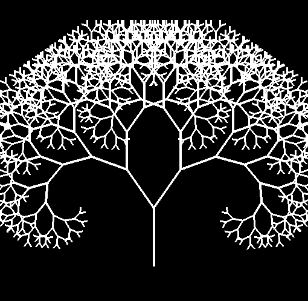

# Parallel-Fractal-Tree
 GPU-accelerated fractal tree generation with CUDA and OpenGL interoperability.
 
# Fractal Tree

The Fractal Tree is a well-known fractal that visually represents the concept of recursion in nature. The construction of this fractal begins with a single trunk, which then splits into two branches at a certain angle. Each of these branches further splits into two smaller branches, continuing this process recursively.  The initial iterations of this fractal are shown below.

<div>
  <p>
    
    
    
    
  </p>
</div>

## Constructing branches

Let the points $A(x_1, y_1)$ and $B(x_2, y_2)$ be given. We have to find the point
$C(c_1, c_2)$ such that
$\overrightarrow{AB} = \lambda \overrightarrow{BC}$, and the points $C'$ and
$C''$ such that $\angle CBC' = \alpha = \angle CBC''$. 

<p>
   
</p>

\
From the equation $\overrightarrow{AB} = \lambda \overrightarrow{BC}$ we get

$$(x_2 - x_1, y_2 - y_1) = \lambda (c_1 - x_2, c_2 - y_2)$$

\
By equating the corresponding coordinates of the pairs listed on both sides
of the equation we get

$$x_2 - x_1 = \lambda (c_1 - x_2)$$ 

$$y_2 - y_1 = \lambda (c_2 - y_2)$$

\
Solving for $c_1$, $c_2$ we get:

$$c_1 = \frac{x_2 (1 + \lambda) - x_1}{\lambda}$$

$$c_2 = \frac{y_2 (1 + \lambda) - y_1}{\lambda}$$

\
We rotate the point $C$ around the point $B$ by the angle $\alpha$ and get
point $C''$ with coordinates:

$$c_1'' = (c_1 - x_2) \cos(\alpha) - (c_2 - y_2) \sin(\alpha) + x_2$$

$$c_2'' = (c_1 - x_2) \sin(\alpha) + (c_2 - y_2) \cos(\alpha) + y_2$$

\
Similarly, point $C'$ is obtained by rotating point $C$ around point $B$
for the $-\alpha$ angle.

## Number of vertices 
\
Let $f(n)$ be the number of edges of the fractal in $n$ iteration. After
each iteration, the number of edges doubles and we have:

$$f(n) = 2^0 + 2^1 + 2^2 + \cdots + 2^n = 2^{n+1} - 1.$$

\
Each edge has two points and the number of points will be $2 \cdot f(n)$,
and we use this expression to connect the points as segments in part 
visualization.

```
 void renderTreeFromBuffer() {
  glVertexAttribPointer(0, 2, GL_FLOAT, GL_FALSE, 0, nullptr);
  glEnableVertexAttribArray(0);
  glColor3f(0.0f, 0.0f, 0.0f);
  int numberOfVertices = 2 * (pow(2, iteration + 1) - 1);
  glDrawArrays(GL_LINES, 0, numberOfVertices2(iterations));
  glutSwapBuffers();
 }
```

## Parallelization

Parallelization occurs in a hierarchical manner, where in each iteration they will be
active a certain number of threads. Each active thread will get 
the $i$ -th branch of the picture, and thread $i$ will construct the right branch or
left depending on the index. The newly acquired branch is inserted into the array of
all branches. The size of this array will be $f(n)$.

\
For each iteration there will be $2^n$ active threads. With the increase of
iterations, the number of active threads will rise exponentially:

1. Iteration 0: Only the thread with id 0 is active. This thread initializes the
 initial branch.

2. Iteration 1: Threads 2 and 3 are active. Thread 2 constructs the left branch from the initial branch and inserts it into the branch array at position 2. Thread 3 constructs the right branch and inserts it into the branch array at position 3.

3. Iteration 2: Threads 4, 5, 6, and 7 are active. Threads 4 and 5 construct the left and right branches, respectively, of the branch at position 2 in the array. Threads 6 and 7 construct the left and right branches, respectively, of the branch at position 3 in the array. The created branches are inserted into the branch array for the next iteration.

4. Iteration $n$: Threads $2^n$ to $2^{n+1}-1$ will be active.
These threads take the respective branches and, depending on the index, construct the left or right branch.

<p>
   
</p>

\
Parallelization and data insertion are modeled in a binary graph . Each node in the graph represents a thread that constructs a branch, while the edges of the graph represent the branching in future iterations. 
Each thread $i$ takes the branch from the parent position $i/2$ in the branch array, constructs the right or the
left branch, and the newly constructed branch is inserted at position $i$ in the array.
Each level of the graph represents the threads that are working in parallel.

\
The leftmost index at the level n of the graph is:

$$\text{leftMost}(n) = 2^n$$ 

The rightmost index at the level n of the graph is:

$$\text{rightMost}(n) = \text{leftMost}(n+1) - 1 = 2^{n+1} - 1$$ 

Number of of threads working in parallel at level n is:

$$\text{leftMost}(n+1) - \text{leftMost}(n) = 2^{n+1} - 2^n = 2^n$$

## The kernel

The following kernel generates the fractal through parallel computation. Initially, the thread with index 0 handles the initial branch. For each iteration, threads within the interval start_at to end_at are active and construct new branches. Threads with even index numbers construct the left branches, while threads with odd index numbers construct the right branches. The constructed branches are stored in the branch array, which will be branched in the next iteration. The two endpoints of the branch are added to the points array. Synchronization ensures that all threads complete their tasks before proceeding to the next iteration.

```
__global__ void branchDivide(float* points, Branch branch, Branch* branches, float angle_left, float angle_right, int start_iteration, int max_iterations, int threadShiftIndex) {

    int idx = threadIdx.x + blockIdx.x * blockDim.x;;
    idx += threadShiftIndex;
    
    Branch childBranch,parentBranch;
    float angle;
    auto g = cg::this_grid();
    
    if (idx == 0) {
        points[0] = branch.start.x;
        points[1] = branch.start.y;
        points[2] = branch.end.x;
        points[3] = branch.end.y;
        branches[1] = branch;
    }
    
    for (int iteration = start_iteration; iteration <= max_iterations; iteration++) {
        float start_at = round(pow(2, iteration));
        int end_at = round((pow(2, iteration + 1))) - 1;
    
        if (idx >= start_at && idx <= end_at) {
            int parentNode = idx / 2;
            parentBranch = branches[parentNode];
            int t = idx % 2;
            
            if (t == 0) {
                angle = angle_left;
            }
            else {
                angle = angle_right;
            }
            
            childBranch = makeChildBranch(parentBranch,angle);
            branches[idx] = childBranch;
            //add points to points array;
            int offset = 2 * 2 * (idx - 1);
            points[offset] = childBranch.start.x;
            points[offset + 1] = childBranch.start.y;
            points[offset + 2] = childBranch.end.x;
            points[offset + 3] = childBranch.end.y;
        }
    g.sync();
    }
}
```

## Comparisons

The table below compares the execution time in microseconds of the fractal between the sequential version and the parallel version. The CUDA implementation was done using cooperative groups, with 23,040 threads per kernel call. 

<table>
  <caption>KTime comparison.</caption>
  <thead>
    <tr>
      <th>Iterimi</th>
      <th>C++</th>
      <th>CUDA</th>
    </tr>
  </thead>
  <tbody>
    <tr><td>0</td><td>23</td><td>27</td></tr>
    <tr><td>1</td><td>40</td><td>25</td></tr>
    <tr><td>2</td><td>47</td><td>23</td></tr>
    <tr><td>3</td><td>39</td><td>28</td></tr>
    <tr><td>4</td><td>40</td><td>27</td></tr>
    <tr><td>5</td><td>58</td><td>27</td></tr>
    <tr><td>6</td><td>332</td><td>29</td></tr>
    <tr><td>7</td><td>288</td><td>28</td></tr>
    <tr><td>8</td><td>105</td><td>26</td></tr>
    <tr><td>9</td><td>155</td><td>26</td></tr>
    <tr><td>10</td><td>436</td><td>27</td></tr>
    <tr><td>11</td><td>541</td><td>24</td></tr>
    <tr><td>12</td><td>733</td><td>29</td></tr>
    <tr><td>13</td><td>1563</td><td>29</td></tr>
    <tr><td>14</td><td>2576</td><td>43</td></tr>
    <tr><td>15</td><td>4861</td><td>47</td></tr>
    <tr><td>16</td><td>9027</td><td>89</td></tr>
    <tr><td>17</td><td>22230</td><td>148</td></tr>
    <tr><td>18</td><td>37435</td><td>253</td></tr>
    <tr><td>19</td><td>75886</td><td>382</td></tr>
    <tr><td>20</td><td>145146</td><td>745</td></tr>
    <tr><td>21</td><td>294950</td><td>1268</td></tr>
    <tr><td>22</td><td>584644</td><td>2560</td></tr>
    <tr><td>23</td><td>1184101</td><td>5265</td></tr>
    <tr><td>24</td><td>2347734</td><td>142678</td></tr>
    <tr><td>25</td><td>4705941</td><td>439919</td></tr>
    <tr><td>26</td><td>9416423</td><td>789610</td></tr>
  </tbody>
</table>


<p>
   
</p>****

[\[fig:tree_graph\]](#fig:tree_graph){reference-type="ref"
reference="fig:tree_graph"}.
